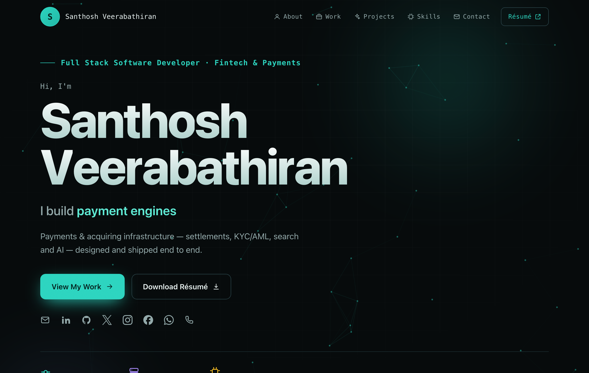
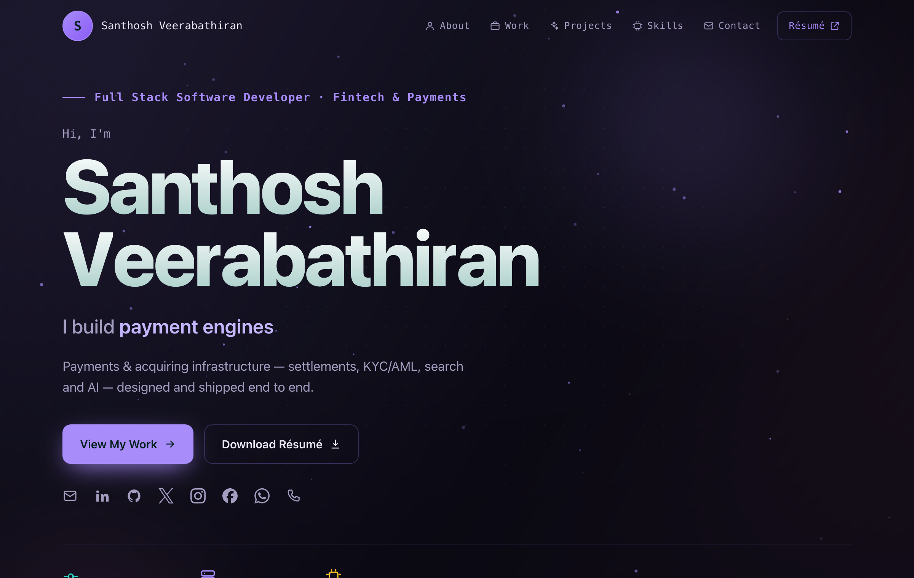

<div align="center">



# 🌊 Santhosh Veerabathiran — Portfolio

**Full-Stack Software Engineer · Fintech &amp; Payments**

[](https://santhosh-veerabathiran.github.io/santhosh-portfolio/)
&nbsp;
[](assets/resumes/Santhosh_V_Resume.pdf)

<br />


</div>

---

## ✨ Overview

A hand-built, single-page developer portfolio — dark theme, teal accent, and a fully custom set of
animations with **no libraries and no build step**. Just open `index.html`.

> 🔗 **Live:** https://santhosh-veerabathiran.github.io/santhosh-portfolio/

## 🎬 Features

- 🌌 **Interactive particle-network canvas** in the hero that reacts to your cursor
- ⌨️ **Typewriter** headline cycling through focus areas + a staggered **letter reveal** on the name
- 🔢 **Count-up stats** that animate when scrolled into view
- 🪄 **3D-tilt cards** with a cursor-tracking glow, a **magnetic** CTA, and a page **spotlight**
- 🎞️ **Scroll-reveal** sections, an infinite **tech marquee**, and a scroll-progress bar
- 📄 One-click **résumé** download
- ♿ Fully **`prefers-reduced-motion`** aware and mobile-responsive
- 🔗 **Open Graph / Twitter** card for rich link previews

## 🗂️ Structure

```text
santhosh-portfolio/
├── index.html              # markup
├── assets/
│   ├── css/style.css       # all styles
│   ├── js/main.js          # all interactions (class-based, vanilla JS)
│   ├── js/theme.js         # ?theme= loader (class-based, vanilla JS)
│   ├── themes/*.json       # theme definitions (colors, fonts, background)
│   ├── images/og-image.png # social-preview card (1200×630)
│   └── resumes/Santhosh_V_Resume.pdf
├── .prettierrc             # formatter config
└── package.json            # format scripts
```

## 🚀 Getting Started

```bash
# open directly, or serve the folder:
python3 -m http.server 8000
# → http://localhost:8000
```

## 🎨 Themes

Themes are JSON files in **`assets/themes/`**, selected with a `?theme=<name>` query — no UI switcher.
Each file drives colours, fonts, background pattern, and the animated background (canvas mode, aurora,
orbs) plus its motion (drift speed and cursor behaviour: `link` · `repel` · `attract` · `none`).

<table>
  <tr>
    <td align="center"><b>Marine</b> — default · network + orbs<br /><sub><code>?theme=marine</code></sub></td>
    <td align="center"><b>Violet</b> — starfield + aurora<br /><sub><code>?theme=violet</code></sub></td>
  </tr>
  <tr>
    <td></td>
    <td></td>
  </tr>
</table>

> Themes load over `fetch`, so they need the site served over HTTP (`file://` keeps the default).

Design tokens also live at the top of **`assets/css/style.css`** (`--accent`, `--bg`, `--ink`, …).
Content sits in the section markup in **`index.html`**.

## 🧹 Format

```bash
npm run format         # write   (Prettier — tabs, single quotes)
npm run format:check   # verify
```

> Run `npm run format` before every push.

## 🌐 Deploy

Static site — host the folder anywhere. This one runs on **GitHub Pages** (`main` / root),
auto-rebuilding on every push.

## 📬 Contact

[](mailto:santhosh20020923@gmail.com)
[](https://www.linkedin.com/in/santhosh-v-662006286)
[](https://github.com/santhosh-veerabathiran)

<div align="center"><sub>© 2026 Santhosh Veerabathiran</sub></div>
