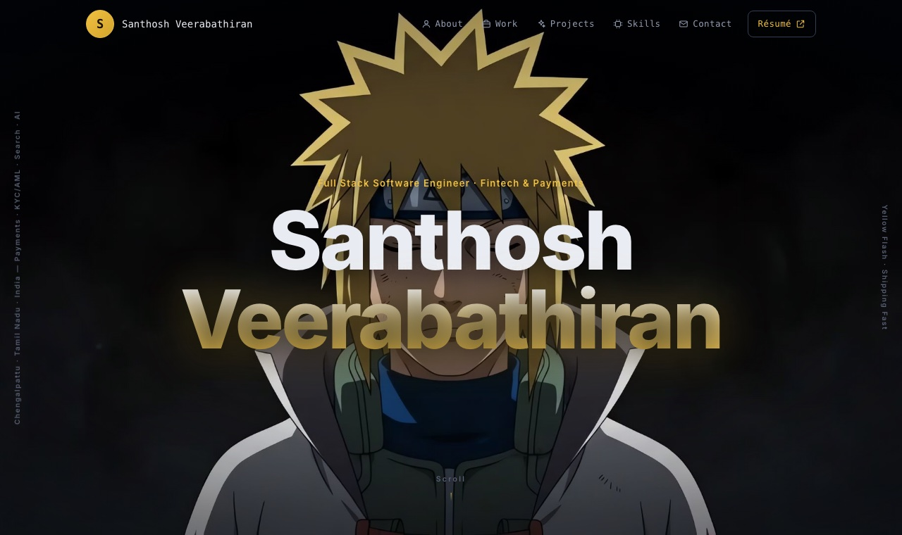

# Minato template

A cinematic, frame-scrubbed experience served at **`/minato/`** — its own document, entry and stylesheet,
fully independent of the classic template and its skins. There is no `?theme=` concept here.

## How it's wired

| Piece          | File                                   | Notes                                                                                                                                   |
| -------------- | -------------------------------------- | --------------------------------------------------------------------------------------------------------------------------------------- |
| Document shell | `minato/index.html` (repo root)        | Own static head: canonical/og:url point at `/minato/`, `noindex` so it never competes with `/` in search. Remove that meta to index it. |
| Entry          | `minato.main.tsx`                      | Applies the tokens + head, renders the layout. Registered in `vite.config.ts` `build.rollupOptions.input`.                              |
| Layout         | `minato.layout.tsx`                    | Composes the acts with the shared classic sections (About, Work, Projects, Skills, Contact) between them.                               |
| Tokens         | `minato.skin.json`                     | Gold/storm palette + Inter via `fontImport`, applied by the shared `lib/skin.runtime`.                                                  |
| Head           | `minato.head.ts`                       | This template's title/description/JSON-LD — edit freely without touching classic.                                                       |
| Copy           | `minato.content.ts`                    | Timeline phases, act copy, rail text, frame-sequence paths/counts.                                                                      |
| Styles         | `minato.css`                           | All `.mt-*` rules, scoped under `[data-active-theme='minato']`.                                                                         |
| Engine         | `frame.sequence.ts`, `minato.hooks.ts` | Frame preloading + cover drawing, scroll-scrub, rasengan auto-sweep with cursor override, legacy sweep-reveal, gold ring cursor.        |
| Acts           | `components/mt.acts.tsx`               | `MtOpen` (141-frame gaze scrub + story phases), `MtDash` (69-frame dash), `MtRas` (65-frame sphere).                                    |

## Assets

`public/assets/minato/` — `frames/{gaze,flash,rasengan}` (1920×1080 JPGs, AI-upscaled, watermark-free;
even-numbered frames are optical-flow interpolated in-betweens added to smooth the scrub)
and `art/` plates — `hero.jpg` backs the About section, `legacy.jpg` is the contact sweep-reveal, and `particle-minato.png` replaces the sweep on touch devices (no hover pointer to drive it). Frame files are `001.jpg…NNN.jpg`; counts live in `minato.content.ts`.

## Deliberate reuse from classic

`classic.css` (base design system), the section components, and `icon.defs` — swap any of them for
minato-owned versions when this template diverges further. Everything else is already self-contained.

## Behavior notes

- Scroll-scrub acts are sticky sections; scrub length = section height (420vh open, 260vh dash).
- Phase visibility bands live in `mt.acts.tsx` (`PHASE_BANDS`).
- `prefers-reduced-motion`: acts collapse to static frames and stacked text; the custom cursor disables.
- `/minato` without a trailing slash redirects to `/minato/` (dev middleware in `vite.config.ts`; static hosting does it in production).
